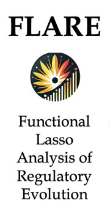
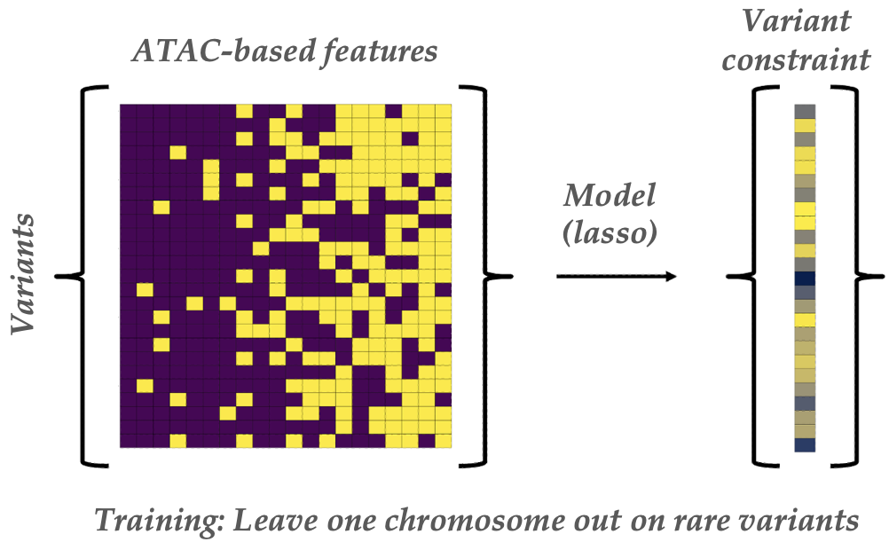
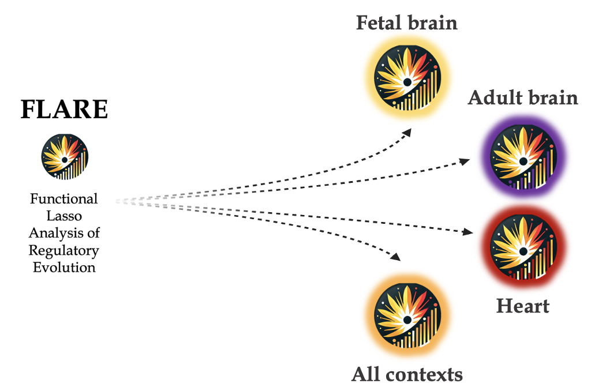

<div align="center">
  
</div>

# 

FLARE integrates ChromBPNet deep learning predictions with evolutionary conservation to prioritize impactful rare non-coding variants. Evolutionary conservation is a key predictor of disease risk, influenced by diverse variant mechanisms. FLARE predicts PhyloP conservation scores using:

- TSS distance
- Nearest gene constraint
- Peak overlap
- ChromBPNet scores
- ChromBPNet scores conditional on the variant residing within a peak

Since PhyloP scores are not context-specific, FLARE models the relationship between genomic context, predicted regulatory effects, and evolutionary conservation in cell contexts where regulation is highly relevant.

<div align="center">
  
</div>

## Key Features

FLARE:
1. Disentangles the contributions of context-specific accessibility and regulatory effects to conservation.
2. Provides an intuitive framework for integrating multiple functional genomic features into a unified model.
3. Captures variants’ regulatory potential across multiple cell types through its predictions.

A powerful advantage of FLARE is its adaptability. The model can be trained on any context of interest (e.g., different tissues, developmental contexts) using ChromBPNet predictions across 8,757,029 ultra-rare variants in 1KG.

<div align="center">
  
</div>

---

## Repository Overview

This repository provides code for **FLARE model training** and **FLARE predictions**. Below is an example workflow using ASD de novo mutations for training and prediction. This smaller dataset is ideal for testing the code. However, the results described in the manuscript from Marderstein, Kundu et al. are based on training with the rare variants matrix and making predictions on the ASD set.

---

## Getting Started

### Step 0: Prerequisites

Ensure the following R packages are installed and can be loaded:

```R
library(data.table)
library(optparse)
library(glmnet)
```

You can use a Conda environment to manage dependencies:

```
conda activate r
```

#### Download Input Data

Download the input data from the Synapse directory: https://www.synapse.org/Synapse:syn64693551/files/ 

#### Compute Requirements

The uncompressed rare variant file is over 40GB! Ensure you have sufficient memory. For interactive use:

```
srun --account=smontgom --partition=batch --time=24:00:00 --mem=128G --nodes=1 --ntasks=1 --cpus-per-task=1 --pty bash
```

## Step 1. Create input feature matrix

From the FLARE root directory:


```
cd scripts
input="/oak/stanford/groups/smontgom/amarder/synapse/predictions/asd.all_dataset.K562_bias.annot2.txt.gz"
output="/oak/stanford/groups/smontgom/amarder/FLARE/data/ASD.FLARE-fb.txt"
model="fetal_brain"
./FLARE_Preprocess.R -i $input -o $output -m $model
```

You can specify one of the following models:

- `"baseline"` (baseline model)
- `"fetal_brain_peaksonly"` (FLARE-fetal brain excluding ChromBPNet predictions)
- `"fetal_brain"` (FLARE-fetal brain)
- `"adult_brain"` (FLARE-adult brain)
- `"brain"` (FLARE-brain)
- `"heart"` (FLARE-heart)
- `"all"` (FLARE-all)

## Step 2. Train FLARE Models

FLARE fits a lasso regression model on the input feature matrix to predict PhyloP conservation scores. Regularization hyperparameters are tuned with 4-fold cross-validation. For each chromosome, FLARE scores are predicted from a model trained on the remaining chromosomes.

```
input="/oak/stanford/groups/smontgom/amarder/FLARE/data/ASD.FLARE-fb.txt"
outdir="/oak/stanford/groups/smontgom/amarder/FLARE/models/ASD.FLARE-fb"
model="fetal_brain"
./FLARE_Training.R -i $input -o $outdir
```

## Step 3. Compute FLARE Scores for New Variants

```
input="/oak/stanford/groups/smontgom/amarder/FLARE/data/ASD.FLARE-fb.txt"
output="/oak/stanford/groups/smontgom/amarder/FLARE/predictions/ASD.FLARE-fb.ASD.txt"
modelpath="/oak/stanford/groups/smontgom/amarder/FLARE/models/ASD.FLARE-fb"
./FLARE_Predict.R -i $input -o $output -m $modelpath
```

## Applications

For downstream applications of FLARE scores (e.g., to ASD), refer to the [manuscript GitHub repository](https://github.com/kundajelab/neuro-variants/).

## Contact

For any questions, please contact:

Andrew Marderstein & Soumya Kundu 📧 andrew.marderstein@gmail.com, soumyak@stanford.edu

## Cite

Marderstein, Kundu, et al. Mapping the regulatory effects of common and rare non-coding variants across cellular and developmental contexts in the brain and heart.
